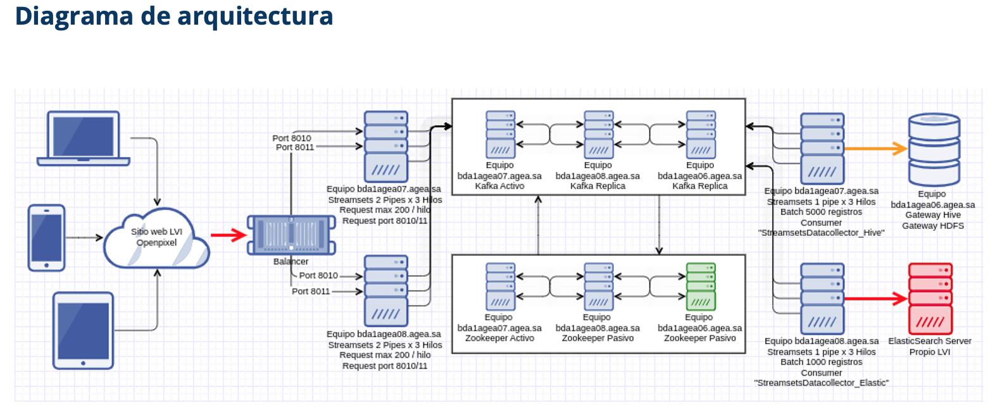

## Current State Architecture

En esta sesión trabajamos sobre dos pilares fundamentales: 
- Entendimiento de la arquitectura on-premises actual.
- Relevamiento de la infraestructura existente según la etapa del dato.

### Arquitectura Actual

### Discovery & Inventory Template
[Planilla de Relevamiento](https://docs.google.com/spreadsheets/d/1hDML9WJpeqZLMwYPa8qFpf9tpAZuP0YzpiM8DkmpwTQ/edit?resourcekey=0-PBJO_Q1pa8K4w7RCXH2OZw#gid=0)

### Links Importantes
- [Grabación de la Sesión](https://drive.google.com/file/d/1BTi9tmZ1ND_16uYwlAJ6wLWSwbIeqRsW/view?usp=sharing)